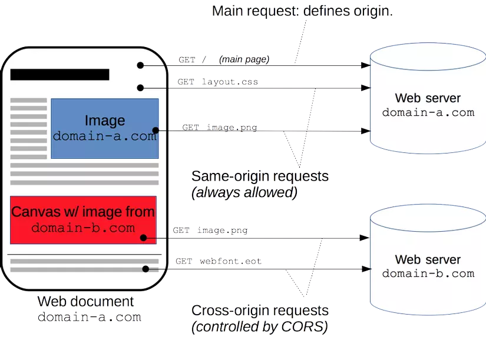

# CORS -> Cross - Origin Resource Sharing  

# Hay còn được gọi là chia sẻ tài nguyên chéo.   

    
Web document có domain là domain-a.com.   
Image có source lấy từ cũng từ **domain-a.com** được gọi là same origin.      
Canvas/img có source lấy từ **domain-b.com**, được gọi là cross-origin.       

Hai trang web được gọi là same origin nếu có chung:    
1. protocol (http, https)
2. Chung domain name 
3. Chung port  

Ví dụ trang **http://example.com/index.html** sẽ có chung origin với:   
- **http://example.com/profile.html**
- **http://example.com:80/profile.html**    
và khác origin với: 
- **https**://example.com/index.html    
http://example.com:**81**/index.html    
http://**blog**.example.com/index.html         

## Same Origin Policy
Cơ chế trong trình duyệt nhằm ngăn cản 1 trang html tương tác tới 1 sever không cùng nguồn với html đó.    
Ví dụ: domain-a gửi request để lấy 1 ảnh từ domain-b  => điều này là không hợp phép.   
Việc này để tránh hiện tượng  [XSS](https://owasp.org/www-community/attacks/xss/ "Cross-Site Scripting (XSS) attacks are a type of injection, in which malicious scripts are injected into otherwise benign and trusted websites.")

## CORS là gì?    
CORS là cơ chế sever dùng để cho phép một hay nhiều domain không cùng origin gửi request đến và truy cập lấy response từ sever.    

Source: 
- https://viblo.asia/p/tim-hieu-ve-cross-origin-resource-sharing-cors-Az45bGWqKxY
- https://developer.mozilla.org/en-US/docs/Web/HTTP/CORS
- https://www.stackhawk.com/blog/django-cors-guide/