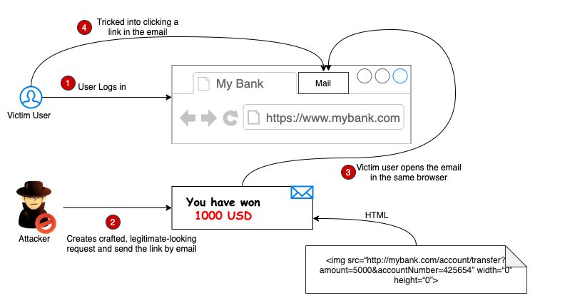

## Cross Site Request Foregy


### Đây là kiểu tấn công khi malicious user cố gắng gửi resquest từ một nơi khác mà không phải là site của server đã response  trước đó.

   

## Mô phỏng tình huống banking
1. Nạn nhân mở trang www.mybank.com và đăng nhập vào hệ thống. 
2. Một kẻ tấn công nào đó gửi cho bạn thông báo vào email rằng bạn đã nhận được 1000USD, click vào link này rồi nhập thông tin để nhận.
3. Sau đó như mọi hôm, bạn mở email lên mà đọc được thông báo của kẻ tấn công. 
4. Bạn click vào link. Sau đó, bạn nhập thông tin cá nhân vào form. Submit form, kẻ tấn công dùng thông tin này để gửi POST method tới banking để chuyển tiền của bạn vào tk của kẻ tấn công. Và bạn mất số tiền đó. 

```html

Post method will looks like this. 
<a href="http://yourbank.com/transfer?to=brian&amt=2800">
    Click Here!
</a> 
and you clicked it in your browser, it will send it to web server. You lost 2800USD

```

## Phòng chống. 
Ở django framework, khi render bất cứ form nào thì sever sẽ luôn cung cấp đi kèm với 1 token gọi là **CSRF token**, khi request được gửi đi Django sẽ check mã token này có khớp với sever không và nếu không thì sever sẽ không thực hiện, việc này đảm bảo rằng sever sẽ chỉ xử lý request tới từ origin.


Source:
- https://reflectoring.io/complete-guide-to-csrf/