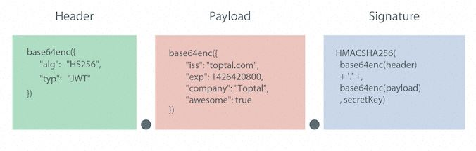

# Json Web Token

## Là một chuẩn để việc trao đổi dữ liệu giữa các bên (sever, client...) được bảo mật và xác thực. 
1. Ưu:
    - **stateless**: các thông tin xác thực nằm ngay chính trên chuỗi JWT, server không cần phải lưu session cho việc xác thưc. Điều này sẽ giúp hệ thống dễ dàng scale.
    - JWT có thể dùng để xác thực. Nên có thể dùng để phòng tránh **CSRF** 
2. Nhược:
    - JWT sẽ bị thu hồi khi hết hạn. Không thể tái sử dụng hoặc thay đổi.
    - 


## Cấu trúc của một JWT. 
Có 3 phần:    
1. HEADER
2. PAYLOAD
3. SIGNATURE Chữ kí số.

Vậy chuỗi token sẽ có dạng như sau: **Base64(HEADER).Base64(PAYLOAD).Base64(SIGNATURE)**
   


### Header chứa kiểu dữ liệu và thuật toán để mã hóa (encryption). 
```json
{
    "typ": "JWT",
    "alg": "HS256"
}
```
- **"typ" (type)** chỉ ra rằng đối tượng là một JWT
- **"alg" (encryption algorithm)** xác định thuật toán **mã hóa** mã hóa cho chuỗi là HS256

### PayLoad chứa thông tin mình muốn đặt trong chuỗi như:client ID, expireTime, role.... đây chứa thông tin về xác thực.

```json
{
  "user_name": "thinh",
  "user_id": "1513717410",
  "admin":true
}

```

### Chữ kí số: sử dụng để xác thực rằng mã token là đáng tin cậy và không bị sửa đổi khi truyền đi. 
Phần này sẽ được tạo ra bằng encode header, payload và kèm theo 1 khóa bí mật. 

```js
data = base64urlEncode( header ) + "." + base64urlEncode( payload )
signature = Hash( data, secret );

```

## How JWT validated?

1. JWT = base64(header).base64(payload).base64(signature)
2. Sever tạo ra JWT gửi client. Từ đó mỗi khi gửi request tới sever, client luôn gửi jwt đi cùng trong header. Client -------JWT------ Sever
3. 
- Sever tạo signature = hash(encode(header) + encode(payload), secret_key) . Lưu ý secret_key này sever nắm giữ. 
- Khi sever validate:check  signature == hash(encode(header) + encode(payload), secret_key)


Source:
- https://topdev.vn/blog/jwt-la-gi/
- https://auth0.com/docs/secure/tokens/json-web-tokens/json-web-token-structure