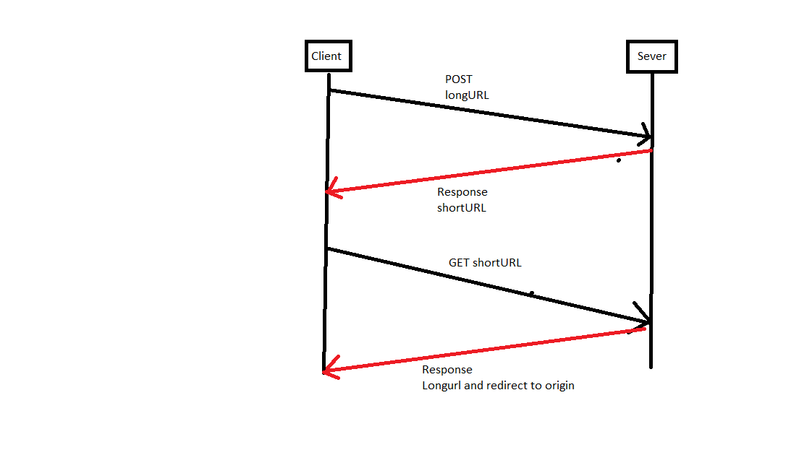
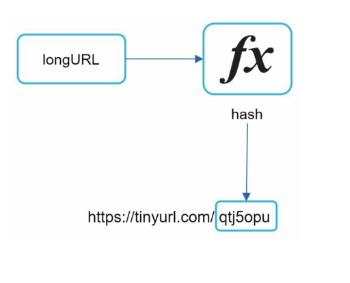
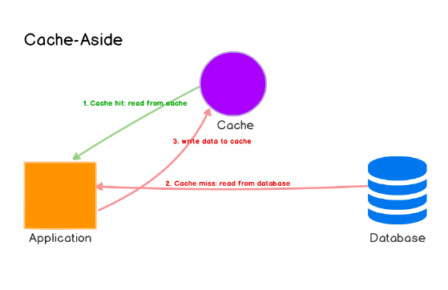

# Thiết kế shorten url 

##  1. Vì sao lại cần shorten link? 
Sử dụng link rút gọn sẽ làm thuận tiện cho việc post link cho nhóm, lên fb, lên MXH. Thay vì post 1 link dài như dưới    
> https://www.educative.io/courses/grokking-the-system-design-interview/m2ygV4E81AR

Thì ta chỉ cần 1 link rút gọn như này là đủ. 
> https://tinyurl.com/rxcsyr3r     

=> Tính năng rút ngắn URL được sử dụng để tối ưu hóa các liên kết trên các thiết bị, theo dõi các liên kết riêng lẻ để phân tích đối tượng, đo lường hiệu suất của chiến dịch quảng cáo hoặc ẩn các URL gốc được liên kết.

## 2. Yêu cầu mục tiêu của hệ thống. 
### 2.1 Các yêu cầu về chức năng. 
1. Cho 1 link URL, cần phải tạo ra link rút gọn và tên rút gọn này là duy nhất.
2. Độ dài link rút gọi này nên trong khoảng 7,8 kí tự. Để là 8 kí tự.   
3. Shorten link này có thời gian hết hạn, sau 1 khoảng thời gian link rút gọn này sẽ biến mất. 
4. .....

### 2.2 Yêu cầu non-functional
1. Link rút gọn được tạo ra một cách ngẫu nhiên, không đoán trước được. 
2. Độ trễ Latency p99 =? Mức đáp ứng ? Throughput bao nhiêu MB? Có thể đặt giả sử mỗi tháng có 500M link rút gọn được tạo mới. 
3. Tỷ lệ read:write là bao nhiêu ? (100:1) 

## 3. Ước lượng tải và các ràng buộc. 
Ta có các giả thuyết: 500M link rút gọn được tạo mỗi tháng     
                      Tỷ lệ read/write là 100.    
1. Scale trong 10 năm. 
=> Có tất cả 10 năm * 12 months * 500Mb = ~60 bilion URLs
2. QPS
Mỗi tháng có 500M = 5e8 link đươc tạo ra.
write QPS = 500M/(second per month) = 5e8/(2e6) ~**200**qps
read QPS = 100 write PQS = 20000qps = **2e4** qps
3. Storage:
- Giả sử sử dụng 100 bytes cho mỗi url.      
- 1 năm cần 12*5e8*1e2 = **6e11bytes**
- 10 năm cần 6e12 Bytes = **6TB**
4. Cache: Dựa vào qui luật 80-20, lưu 20% lượng cần nhớ để đáp ứng 80% lượng truy vấn.    
- QPS 2e4 => query per day = 2e5*1e5 = **2e9**
- Cache storage: 2e9*20% *100bytes = 4e9 MB   

## 4 APIs
Sẽ hỗ trợ GET và POST. 
1. POST api/v/shorten 
    - parameter: longURL
    - respone: shorterURL
2. GET api/v/{shortULR}
    - status code 301 (redirect)
    - respone: long url

## 5 Database Design 
=> Lựa chọn SQL.    
Thông tin url cần có: Data model là URLtable
URLtable           
- id : PK
- shortURL: varchar
- longURL: varchar
- expireTime: datatime

## 6 Design and Deep dive. 
- Chọn lựa thuật toán biến đổi link thành link rút gọn. 
- Write flow:    
    - longURL => hash(longURL)=> shortURL. 

- Read flow: nhận đầu vào là 1 shortURL, return longURL
    - nếu shortURL ở cache, return longURL từ cache
    - nếu không truy vấn database
        - nếu không tồn tại-> báo lỗi.
        - nếu không lấy ra, lưu vào cache. 
- hash function có thể chọn SHA256 hoặc MD5.
    - Chọn 8 ký tự đầu tiên. Có thể dẫn tới colision với tỷ lệ 1/ (62^8)
    - Kiểu tra colion bằng cách query database -> tốn thời gian. 
    - Sử dụng encoding. theo thứ tự tăng dần của đoạn mã 8 chữ cái (0-9 a-Z) => tránh được hiện tượng colision.
- cache dùng cache aside (vì bài toán là heavy-read), có thể sủ dụng LRU để validation 
  
- Clean up service: Chạy định kì hoăc chỉ định chạy khi lượng traffic là nhỏ nhất để:
    - Xóa url trong database hết hạn.
    - Xóa url hết hạn trong cache.
    - xóa url mà không được đọc trong khoảng 6 tháng - 1 năm.
- Database sharding, replication. Thêm load balancer, thêm sever....
- Rate limiting: hạn chế lạm dụng gửi quá nhiều request post tới server. Chỉ định 1 client chỉ gửi tạo được một số lượng cố định link trên đơn vị thời gian. ie: **10 request/h/client**.

## Implementation
source: