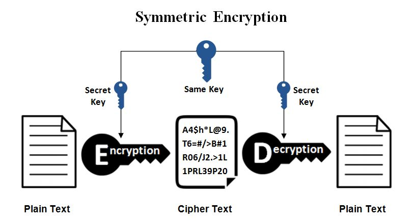
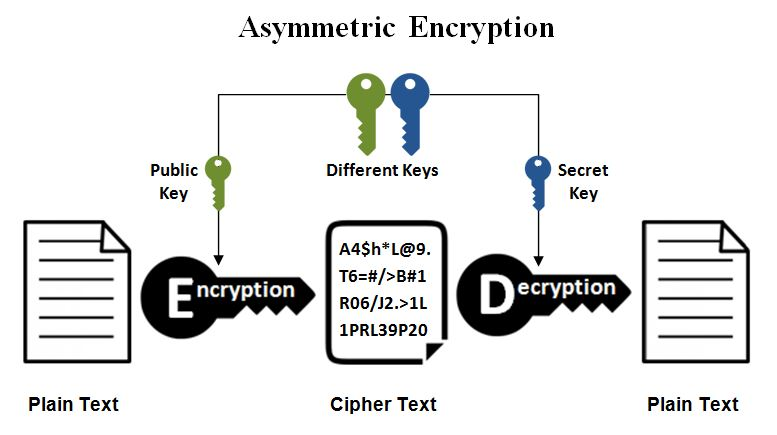

## Quá trình diễn ra TLS handshake như nào?

## Một vài khái niệm 
1. Mã hóa đối xứng (Symetric Encryption).
(https://www.ssl2buy.com/wiki/symmetric-vs-asymmetric-encryption-what-are-differences)
   

- Chỉ sử dụng 1 khóa để encrypt và decrypt. Sender và Reciever phải có chung 1 key.
- Một vài thuật toán mã hóa đối xứng: Blowfish, AES, RC4, DES, RC5, and RC6
- Quá trình encrypt/decrypt rất **nhanh**

2. Mã hóa không đối xứng (Asymmetric Encryption) 
   
- Sử dụng **khóa công khai** (public key)  và **khóa bí mật** (private key).
    - Message được mã hóa bằng 1 khóa thì khóa kia sẽ giải mã được.
    - Giả sử có message **m**, quy ước PK=public key, SK = secret key. 
        - Thông tin sẽ được mã hóa thành **c = encrypt(m,PK)**
        - Sử dụng SK để giả mã ngược **decrypt(c,SK) = m**  
- Một vài thuật toán: RSA
- **Chậm**.

### Ví dụ RSA cho xác thực (Authentication)
- Sender A gửi m cho Reciever B. :
    - A tạo ra **chữ kí số** bằng cách mã hóa mã băm của m và SK. **signature = encrypt(hash(m), SK)**, sau đó gửi đi 2 thông tin **(signature,hash(m))**
    - B nhận cặp thông tin trên, và decrypt lại **signature** sử dụng PK, **value = decrypt(signature, PK)**. Rồi kiểm tra xem **value == hash(m)** hay không. 
    - Nếu kiểm tra không vấn đề gì. **B xác nhận rằng đây là tin từ A và tin này không bị thay đổi khi truyền**

## Quá trình diễn ra TLS 
1. TCP được thiết lập. 
2. Client gửi **ClientHello** tới server bao gồm
    - TLS version support
    - thuật toán cipher suites mà client hỗ trợ
    - mã random byte ngẫu nhiên
3. Sever gửi **ServerHello** tới client gồm:
    - Chứng chỉ SSL của server gồm vài thông tin như dưới. Mục đích để giúp client xác thực server thông qua CA. 
        - domain name
        - tổ chức sở hữu chứng chỉ
        - Cơ quan cấp chứng chỉ
        - **chữ kí số** (digital signature) của chứng chỉ CA(ertificate authority) 
            - Sử dụng CA pk để decrypt chữ kí số này, sau đó check PK của sever ==  PK trong CA.  
        - ngày cấp
        - ngày hết hạn
        - PK của server. 
    - thuật toán cipher suites phù hợp. 
    - mã random byte ngẫu nhiêu
4. Trao đổi key
    - Client tạo ra random token **pre-master secret**, mã hóa nó bằng PK rồi gửi cho server.
    - Server giải mã **pre-master secret** bằng SK.
    - Cả sever và client lúc này đều có **pre-master secret**
5. Cả client và server tạo **session key** dựa trên **pre-master secret**, **client random bytes**, **server random bytes**.
6. Client gửi message "finished" mã hóa bằng ***session key** cho Server.
7. Server gửi message "finished" mã hóa bằng ***session key** cho Client.
8. Quá trình TLS hoàn thành, kết nối được thiết lập, client và sever sẽ giao tiếp với nhau sử dụng mã hóa đối xứng với key là **session key**

## Follow up question
1. Tại sao không dùng luôn mã hóa bất đối xứng để truyền data?
    - Ans:
        - Bảo mật: Server truyền data và mã hóa nó bằng SK, bất cứ client nào có PK đều có thể đọc được nó.
        - Tốc độ: mã hóa bất đối xứng yêu cầu tính toán nhiều-> chậm
2. Client random và server random bytes để làm gì?
    - Ans:
        - avoid **replay attack**: if there is no client random and server random, hacker capture the package and resend.
 

source:   
- https://www.cloudflare.com/learning/ssl/what-happens-in-a-tls-handshake/ 
- https://blog.bytebytego.com/p/how-does-https-work-episode-6
- https://www.acunetix.com/blog/articles/establishing-tls-ssl-connection-part-5/#:~:text=The%20client%20random%20and%20the,be%20a%20randomly%20generated%20number.
- Fun vãi: https://howhttps.works/the-handshake/